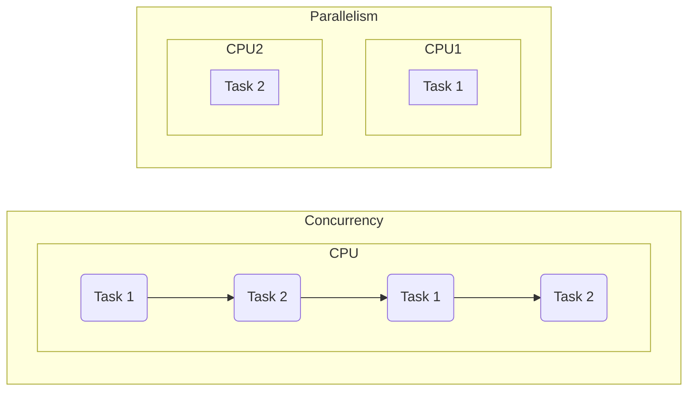

# Interview questions

Which I was asked during my career.

## What is the difference between concurrency and parallelism?

Concurrency is not quite the same as parallelism. 

Parallelism means to run two things exactly on the same time.

This is what happens on multi-core processors. You have one core for one thing and the second for different thing, both run simultaneously. 

Concurrency is about breaking a program into independently executing tasks that **could potentially run at the same time** and still get the right result at the end. So the concurrent program is one that can be parallelized. 

We’re not going to concern ourselves with what is happening on the CPU level and whether something is running on multiple cores or not. The Go runtime and the operating system will take of it for us. So we can concentrate on our program and using the tools that go gives us to make our concurrent.

